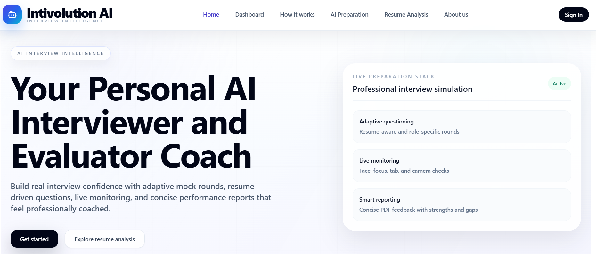
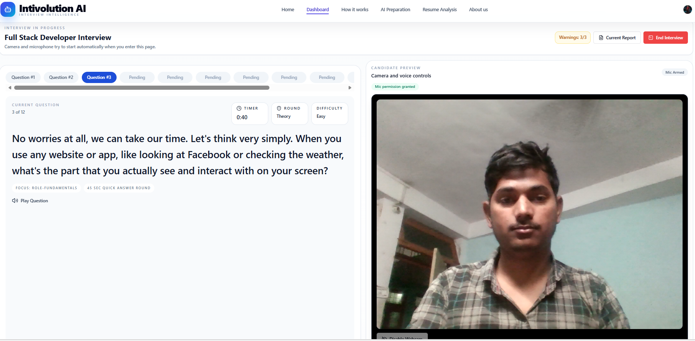
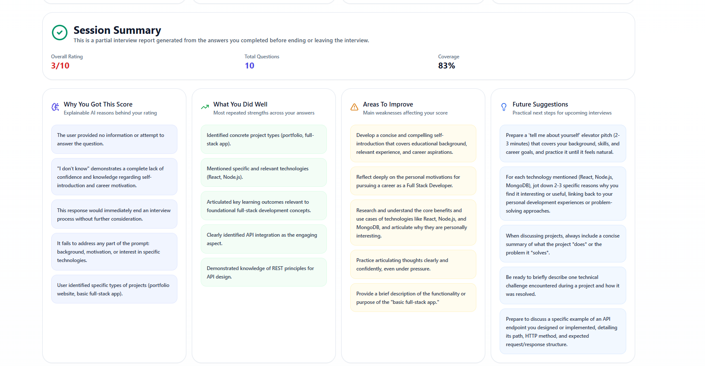

<div align="center">


# Multimodel_Explainable-AI (Intivolution) — AI-Powered Interview Preparation Platform

**Practice smarter. Interview better.**  
An end-to-end AI interview preparation platform with adaptive questioning, real-time voice analysis, resume intelligence, and detailed performance feedback.

[](https://nextjs.org/)
[](https://react.dev/)
[](https://ai.google.dev/)
[](https://clerk.dev/)
[](https://drizzle.team/)
[](https://neon.tech/)
[](https://tailwindcss.com/)
[](LICENSE)

[✨ Live Demo](#) · [📄 Report an Issue](../../issues) · [🤝 Contribute](#contributing)

</div>

---

## 📌 Table of Contents

- [About the Project](#-about-the-project)
- [Key Features](#-key-features)
- [Tech Stack](#-tech-stack)
- [Project Structure](#-project-structure)
- [Getting Started](#-getting-started)
  - [Prerequisites](#prerequisites)
  - [Installation](#installation)
  - [Environment Variables](#environment-variables)
  - [Database Setup](#database-setup)
  - [Running the App](#running-the-app)
- [Screenshots](#-screenshots)
- [Authors](#-authors)
- [License](#-license)
- [Acknowledgements](#-acknowledgements)

---

## 🎯 About the Project

**Intivolution AI** is a final-year B.Tech project built to solve a real problem: most job seekers practice interviews with static question banks and receive zero meaningful feedback. This platform changes that.

It simulates realistic interview sessions using **Google Gemini AI**, generates role-specific and resume-aware questions, records your spoken answers via the **Web Speech API**, and produces a structured performance report with scoring, strengths, weaknesses, and actionable next steps — all without any human evaluator.

> Built as a Final Year Project (FYP) — the system design, research, UI, AI integration, and database architecture were all developed from scratch by the team.

---

## ✨ Key Features

| Feature | Description |
|---|---|
| 🤖 **AI Mock Interviews** | Gemini AI generates custom interview questions based on job role, experience level, and resume |
| 🔄 **Adaptive Questioning** | Questions evolve dynamically based on your previous answers, simulating a real interviewer |
| 🎙️ **Voice-Based Answering** | Record answers using your webcam + microphone via Web Speech API |
| 📊 **Interview Analytics** | Detailed per-session reports with scores, strengths, weaknesses, and improvement tips |
| 📄 **Resume Analysis** | Upload your resume and get AI-powered gap analysis and suggestions |
| 🧠 **Skill Assessment** | Evaluate your technical and soft skills with AI-generated assessments |
| 💬 **AI Prep Coach** | Interactive chat assistant on the dashboard to guide your preparation strategy |
| 📧 **Email Reports** | Interview performance reports delivered to your inbox |
| 🔒 **Secure Auth** | Sign in / Sign up powered by Clerk (Google OAuth + email support) |
| 🌙 **Dark/Light Mode** | Theme-aware UI using `next-themes` |

---

## 🛠️ Tech Stack

### Frontend
- **Next.js 14** (App Router) — Server & client components
- **React 18** — UI library
- **Tailwind CSS** — Utility-first styling
- **Framer Motion** — Animations and transitions
- **Radix UI / Headless UI** — Accessible UI primitives
- **Lucide React / React Icons / Heroicons** — Icon libraries
- **Sonner** — Toast notifications

### AI & Intelligence
- **Google Gemini AI** (`@google/generative-ai`) — Question generation, answer evaluation, feedback

### Auth
- **Clerk** — Authentication (OAuth, email/password, session management)

### Database
- **Neon Database** — Serverless PostgreSQL
- **Drizzle ORM** — Type-safe SQL ORM
- **Drizzle Kit** — DB migrations

### Browser APIs
- **Web Speech API** — Speech-to-text for answer recording
- **react-webcam** — Webcam access in browser

### Utilities
- `uuid`, `moment`, `dotenv`, `clsx`, `tailwind-merge`

---

## 📁 Project Structure

```
intivolution-ai/
├── app/                        # Next.js App Router
│   ├── (auth)/                 # Sign in / Sign up pages (Clerk)
│   ├── about-us/               # About the platform page
│   ├── ai-preparation/         # AI-guided preparation page
│   ├── api/                    # API routes (server-side)
│   │   ├── dashboard-prep-chat/   # AI Prep Coach API
│   │   ├── feedback/              # Interview feedback API
│   │   ├── gemini/                # Gemini AI integration
│   │   ├── interview-report/      # Report generation API
│   │   └── interviews/            # CRUD for interviews & answers
│   ├── dashboard/              # Main user dashboard
│   │   ├── _components/        # Dashboard UI components
│   │   └── interview/[id]/     # Individual interview session
│   │       ├── start/          # Live interview page (webcam + voice)
│   │       └── feedback/       # Post-interview feedback page
│   ├── how-it-works/           # Explainer page
│   ├── resume-analysis/        # Resume upload & analysis
│   └── skill-assessment/       # Skill evaluation page
│
├── components/                 # Shared reusable components
│   ├── home/                   # Landing page sections
│   ├── resume/                 # Resume analyzer component
│   └── ui/                     # shadcn/ui base components
│
├── drizzle/                    # DB migration files
├── lib/                        # Server-side utilities (auth, db queries)
├── utils/                      # Client + shared utilities
│   ├── GeminiAIModal.js        # Gemini API wrapper
│   ├── interview-analytics.js  # Analytics computation
│   ├── report-pdf.js           # PDF report generation
│   ├── interview-report-email.js # Email report sender
│   └── schema.js               # Drizzle DB schema
│
├── public/                     # Static assets (logo, images)
├── .env.example                # Environment variable template
├── drizzle.config.js           # Drizzle ORM config
├── next.config.mjs             # Next.js config
├── tailwind.config.js          # Tailwind config
└── package.json
```

---

## 🚀 Getting Started

### Prerequisites

Make sure you have the following installed:

- **Node.js** v18+ → [Download](https://nodejs.org/)
- **npm** v9+ (comes with Node.js)
- A **Neon** account (free) → [neon.tech](https://neon.tech/)
- A **Clerk** account (free) → [clerk.dev](https://clerk.dev/)
- A **Google Gemini API Key** → [ai.google.dev](https://ai.google.dev/)

---

### Installation

1. **Clone the repository**
   ```bash
   git clone https://github.com/YOUR_USERNAME/intivolution-ai.git
   cd intivolution-ai
   ```

2. **Install dependencies**
   ```bash
   npm install
   ```

3. **Set up environment variables**
   ```bash
   cp .env.example .env.local
   ```
   Fill in your keys (see [Environment Variables](#environment-variables) below).

---

### Environment Variables

Create a `.env.local` file in the root directory. Refer to `.env.example` for all required variables:

```env
# Clerk Authentication
NEXT_PUBLIC_CLERK_PUBLISHABLE_KEY=pk_test_...
CLERK_SECRET_KEY=sk_test_...
NEXT_PUBLIC_CLERK_SIGN_IN_URL=/sign-in
NEXT_PUBLIC_CLERK_SIGN_UP_URL=/sign-up

# Google Gemini AI
NEXT_PUBLIC_GEMINI_API_KEY=AIza...

# Neon Database (PostgreSQL)
DATABASE_URL=postgresql://...
```

> ⚠️ **Never commit your `.env.local` file.** It is already in `.gitignore`.

---

### Database Setup

This project uses **Drizzle ORM** with **Neon Serverless Postgres**.

1. Push the schema to your Neon database:
   ```bash
   npm run db:push
   ```

2. (Optional) Open Drizzle Studio to view/manage data:
   ```bash
   npm run db:studio
   ```

---

### Running the App

```bash
# Development
npm run dev

# Production build
npm run build
npm start
```

Open [http://localhost:3000](http://localhost:3000) in your browser.

---

## 📸 Screenshots

> _Add your screenshots here after deployment_

| Dashboard | Live Interview | Feedback Report |
|---|---|---|
|  |  |  |

---

## 👥 Authors

This project was built as a **Final Year B.Tech Project**.

| Name | GitHub | Role |
|---|---|---|
| **Aman Sharma** | [@23Amansharma](https://github.com/23Amansharma) | Full Stack / AI Integration |
| **Alok Gupta** | [@mrinvictus2005 ](https://github.com/mrinvictus2005) | Full Stack / Data Analyst |

> Both authors contributed equally to the research, design, development, and documentation of this project.

---

## 📄 License

This project is licensed under the **MIT License** — see the [LICENSE](LICENSE) file for full details.

You are free to use, modify, and distribute this project with proper attribution.

---

##  Acknowledgements

- [Google Gemini AI](https://ai.google.dev/) — for the AI question generation and evaluation backbone
- [Clerk](https://clerk.dev/) — for frictionless authentication
- [Neon](https://neon.tech/) — for serverless PostgreSQL
- [Drizzle ORM](https://drizzle.team/) — for the clean, type-safe database layer
- [Vercel](https://vercel.com/) — for deployment

---

<div align="center">

Made with ❤️ as a Final Year Project

⭐ **If this project helped you, consider giving it a star!**

</div>
